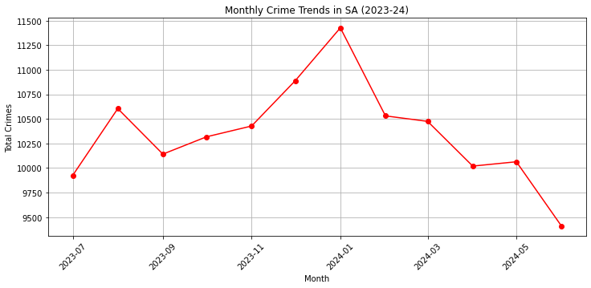
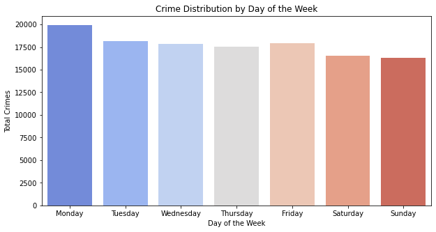

# 📊 SA Crime Analysis (2023-24)

This project analyzes crime trends in **South Australia** using Python. The dataset provides insights into **crime locations, types, severity, and time-based trends**, helping to identify patterns and hotspots.

---

## 🚀 Key Features
- **Crime Trends Over Time**  – Monthly crime analysis
- **Crime by Location**  – Identifies the most crime-affected suburbs
- **Crime Type Analysis**  – Finds the most common crimes in SA
- **Severity Analysis** – Ranks crimes based on severity
- **Day of the Week Trends**  – Highlights the days with the highest crime rates

---

## 📊 Visualizations
- **Crime Trends Over Time** (Line chart)
- **Top 10 Crime-Affected Suburbs** (Bar chart)
- **Crime Type Distribution** (Bar chart)
- **Crime by Day of the Week** (Bar chart)

---

## 🛠️ Technologies Used
- **Python**: Pandas, Matplotlib, Seaborn
- **Data Visualization & Analysis**
- **Jupyter Notebook / Spyder**

---

## 📈 Example Output

## 📢 Insights & Findings
- **Crime peaks on weekends**  – Higher incidents on **Monday**
- **Certain suburbs have significantly higher crime rates** 

---

## 🔗 Additional Links
- **Dataset Source**: https://data.sa.gov.au/data/dataset/crime-statistics

